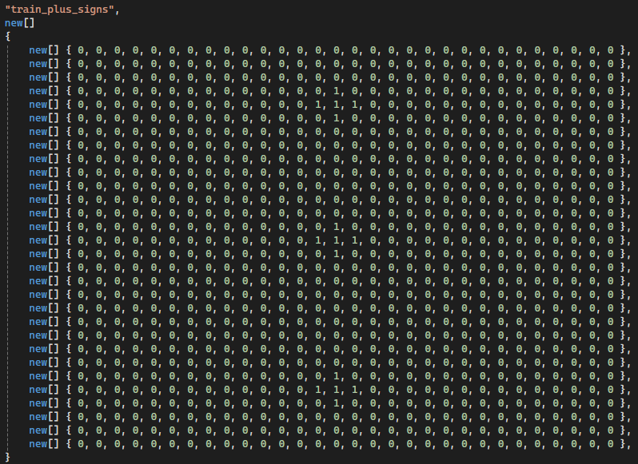
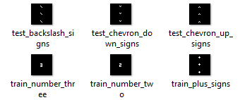

# Similarity Experiment

.....

# Abstract
.....

# Implementation

## Generate Training & Test Input SDR images

-  The below method is used to create input sdrs 

 

    public async Task CreateInputSdrs(string inputSdrDirectoryPath)

- In the file location if the Inputsdrs folder exists then it deletes the folder and creates the new 'inputsdrs' folder

    if(Directory.Exists(inputSdrDirectoryPath))
            {
                Directory.Delete(inputSdrDirectoryPath, true);
            }
            
            Directory.CreateDirectory(inputSdrDirectoryPath);

 
    

- It is calling each input sdr which is defined in InputSdrData.cs program.

 

    var inputSdrs = InputSdrData.GetInputSdrs();

     

-  Input SDR is defined in 2D array, instead of giving images we used this method so we have the exact dimension of image and find similarity have more accuracy.

- Later, we can find the input SDRs has been stored in InputSdrs folder. Input SDR images are stored in the below fashion.

## Start Similarity Experiment

 

     public async Task RunExperiment(string inputSdrsFolderPath, BinarizerParams imageEncoderSettings)
        {
            _logger.LogInformation($"Hello NeocortexApi! Running {nameof(SimilarityExperiment)}");

            int inputBits = imageEncoderSettings.ImageHeight * imageEncoderSettings.ImageWidth;
            int numColumns = inputBits;
            var inputSdrs = GetInputSdrs(inputSdrsFolderPath);

### Configuration

 In HTMConfig we used the standard configuration as mentioned below, 

     CellsPerColumn = 30,
                GlobalInhibition = true,
                LocalAreaDensity = -1,
                NumActiveColumnsPerInhArea = 0.02 * numColumns,
                PotentialRadius = (int)(0.15 * inputBits),
                //InhibitionRadius = 15,

                MaxBoost = 10.0,
                DutyCyclePeriod = 25,
                MinPctOverlapDutyCycles = 0.75,
                MaxSynapsesPerSegment = (int)(0.02 * numColumns),

                ActivationThreshold = 15,
                SynPermConnected = 0.5,

                // Learning is slower than forgetting in this case.
                PermanenceDecrement = 0.25,
                PermanenceIncrement = 0.15,

                // Used by punishing of segments.
                PredictedSegmentDecrement = 0.1

In Homeostatic Plasticity Controller configuration we have set the minimum cycles as 3 times the count of input sdrs and maximum cycles as 4.5 times the count of input sdrs 

 

     var numUniqueInputs = inputSdrs.Count;

            var homeostaticPlasticityControllerConfiguration = new HomeostaticPlasticityControllerConfiguration()
            {
                MinCycles = numUniqueInputs * 3,
                MaxCycles = (int)((numUniqueInputs * 3) * 1.5),
                NumOfCyclesToWaitOnChange = 50
            };

## Fetching Training & TestInput SDR images

## Input Encoder

## Training & Test input SDRs

## Spatial Pooler

## Training & Test Output SDRs

## Foreach Output SDR

## Find Similarity via Classifier

