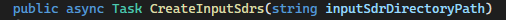
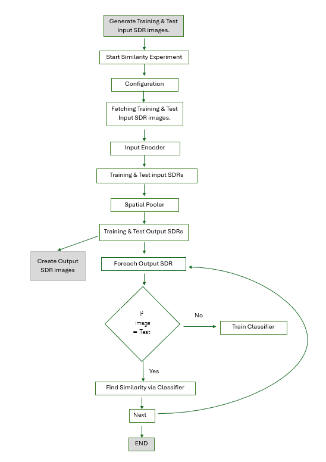

# Similarity Experiment

.....

# Abstract
.....

# Implementation

## Generate Training & Test Input SDR images

***public async Task CreateInputSdrs(string inputSdrDirectoryPath)***

The above method is used to create input sdrs 

In the file location if the Inputsdrs folder exists then it deletes the folder and creates the new 'inputsdrs folder'

## Start Similarity Experiment

## Configuration

## Fetching Training & TestInput SDR images

## Input Encoder

## Training & Test input SDRs

## Spatial Pooler

## Training & Test Output SDRs

## Foreach Output SDR

## Find Similarity via Classifier

