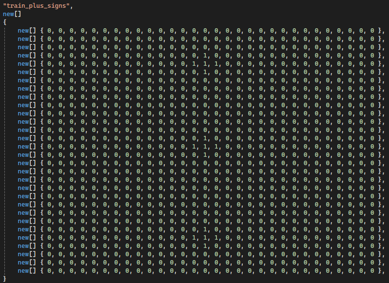
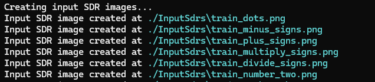
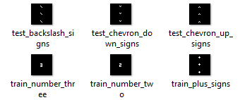
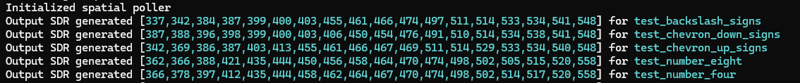
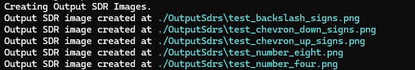
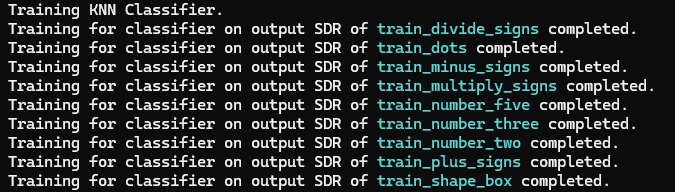
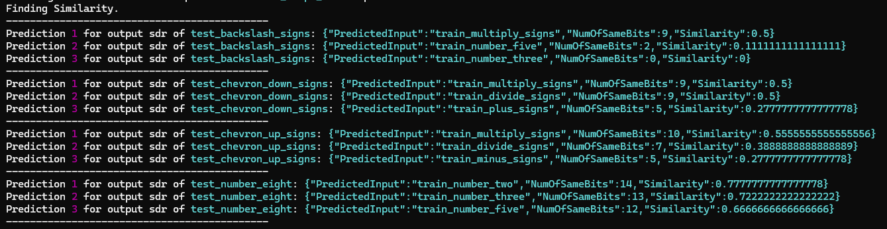
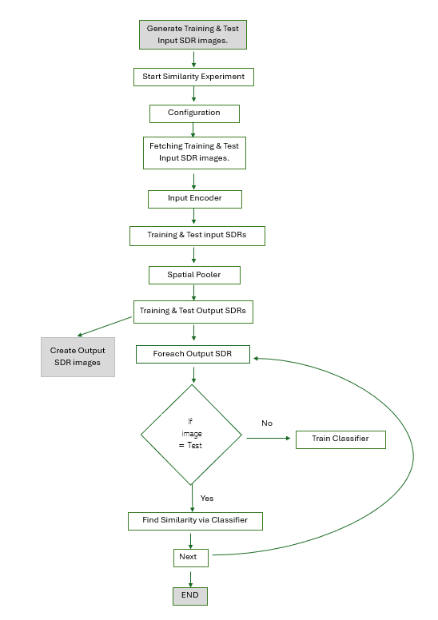

# Similarity Experiment

.....

# Abstract
.....

# Implementation

The Neocortex API is used to design and integrate the KNN (K-Nearest-Neighbor) Classifier. To train the model, it receives a series of values and preassigned labels. The user can provide unclassified sequences that require labeling after the model (a dictionary mapping of labels to their sequences) has been trained. 


## Generate Training & Test Input SDR images

-  The below method is used to create input sdrs 

```
public async Task CreateInputSdrs(string inputSdrDirectoryPath)
```

- In the file location if the Inputsdrs folder exists then it deletes the folder and creates the new 'inputsdrs' folder

```

if(Directory.Exists(inputSdrDirectoryPath))
{
    Directory.Delete(inputSdrDirectoryPath, true);
}

Directory.CreateDirectory(inputSdrDirectoryPath);
``` 
    


- It is calling each input sdr which is defined in InputSdrData.cs program.

```

var inputSdrs = InputSdrData.GetInputSdrs();

```
     

-  Input SDR is defined in 2D array, instead of giving images we used this method so we have the exact dimension of image and find similarity have more accuracy.



- The input SDRs are being created




- Later, we can find the input SDRs has been stored in InputSdrs folder. Input SDR images are stored in the below fashion.




## Start Similarity Experiment


```
 public async Task RunExperiment(string inputSdrsFolderPath, BinarizerParams imageEncoderSettings)
    {
        _logger.LogInformation($"Hello NeocortexApi! Running {nameof(SimilarityExperiment)}");

        int inputBits = imageEncoderSettings.ImageHeight * imageEncoderSettings.ImageWidth;
        int numColumns = inputBits;
        var inputSdrs = GetInputSdrs(inputSdrsFolderPath);
```

### Configuration

 In HTMConfig we used the standard configuration as mentioned below, 
```
CellsPerColumn = 30,
GlobalInhibition = true,
LocalAreaDensity = -1,
NumActiveColumnsPerInhArea = 0.02 * numColumns,
PotentialRadius = (int)(0.15 * inputBits),
//InhibitionRadius = 15,

MaxBoost = 10.0,
DutyCyclePeriod = 25,
MinPctOverlapDutyCycles = 0.75,
MaxSynapsesPerSegment = (int)(0.02 * numColumns),

ActivationThreshold = 15,
SynPermConnected = 0.5,

// Learning is slower than forgetting in this case.
PermanenceDecrement = 0.25,
PermanenceIncrement = 0.15,

// Used by punishing of segments.
PredictedSegmentDecrement = 0.1

```
In Homeostatic Plasticity Controller configuration we have set the minimum cycles as 3 times the count of input sdrs and maximum cycles as 4.5 times the count of input sdrs 

```
 var numUniqueInputs = inputSdrs.Count;

var homeostaticPlasticityControllerConfiguration = new HomeostaticPlasticityControllerConfiguration()
{
    MinCycles = numUniqueInputs * 3,
    MaxCycles = (int)((numUniqueInputs * 3) * 1.5),
    NumOfCyclesToWaitOnChange = 50
};

```

## Fetching Training & TestInput SDR images

## Input Encoder

## Training & Test input SDRs

## Spatial Pooler



### Generate Output SDRs

```
logger.LogInformation("Generating Output SDRs.");
var outputSdrs = GenerateOutputSdrs(
    htmConfig, 
    homeostaticPlasticityControllerConfiguration, 
    encoder, 
    inputSdrs);
```

### Creating Output SDRs Images

```
_logger.LogInformation("Creating Output SDR Images.");
var outputSdrFolderPath = "./OutputSdrs";
await CreateOutputSdrImages(
    outputSdrFolderPath, 
    outputSdrs, 
    imageEncoderSettings.ImageHeight, 
    imageEncoderSettings.ImageWidth);
```




## Training & Test Output SDRs

Train KNN classifier using training output SDRs and Predict test output SDRs

We are assigning KNeighborsClassifier, here we will call all the training output sdr from the output sdrs folder. 


```
var classifier = new KNeighborsClassifier<string, int[]>();
foreach (var trainingOutputSdr in outputSdrs.Where(x => x.Key.Contains("train")))
```
 

The classifier will then learn and get trained be output SDRs.

```
classifier.Learn(trainingOutputSdr.Key, trainingOutputSdr.Value.Select(x => new Cell(0, x)).ToArray());        
```



## Foreach Output SDR

## Find Similarity via Classifier

We will call all the test output sdrs from the output sdrs folder. 

```
foreach (var testOutputSdr in outputSdrs.Where(x => x.Key.Contains("test")))          
```

After the prediction is complete the it will take top 3 prediction based on highest similarities, with the number of similar bits and the percentage of similarity.




# Flow Chart of Experiment




