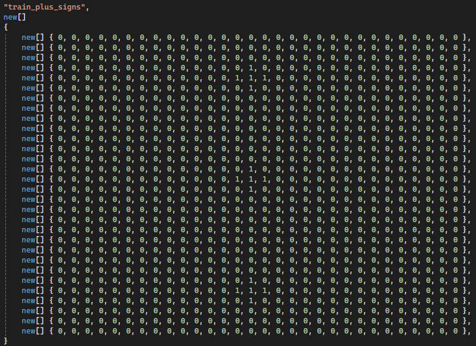
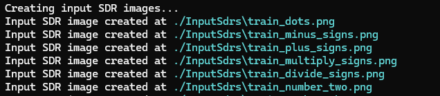
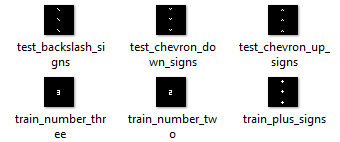
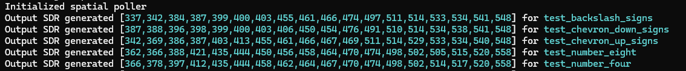
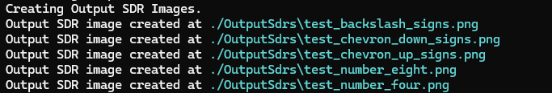
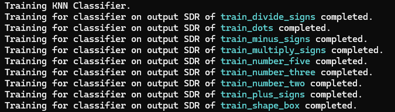
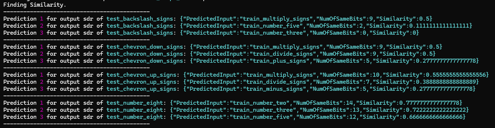
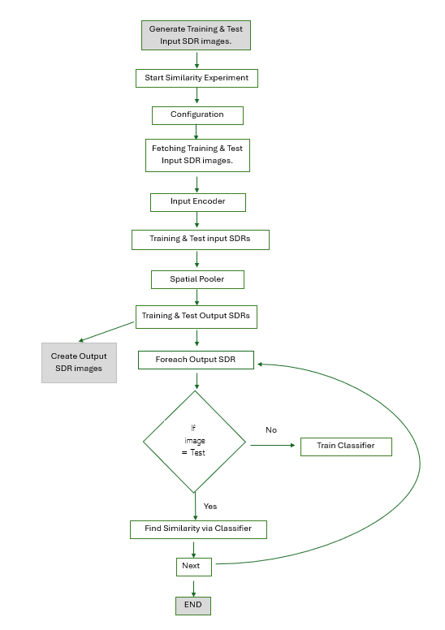

# Similarity Experiment


# Implementation

The Neocortex API is used to design and integrate the KNN (K-Nearest-Neighbor) Classifier. To train the model, it receives a series of values and preassigned labels. The user can provide unclassified sequences that require labeling after the model (a dictionary mapping of labels to their sequences) has been trained. 


## Generate Training & Test Input SDR images

-  The below method is used to create input sdrs. It creates input SDR images from 2D array of 1 and 0 values.

```
public async Task CreateInputSdrs(string inputSdrDirectoryPath)
```

- In the file location if the Inputsdrs folder exists then it deletes the folder and creates the new 'inputsdrs' folder

```

if(Directory.Exists(inputSdrDirectoryPath))
{
    Directory.Delete(inputSdrDirectoryPath, true);
}

Directory.CreateDirectory(inputSdrDirectoryPath);
``` 
    


- It is calling each input sdr which is defined in InputSdrData.cs program. Get input SDR data in 2D arrays of 1 and 0 values

```

var inputSdrs = InputSdrData.GetInputSdrs();

```
     

-  Input SDR is defined in 2D array, instead of giving images we used this method so we have the exact dimension of image and find similarity have more accuracy.
Key and Value with Key being name of the image and value being the 2D array of 1's and 0's



- The input SDRs are being created. Create input SDR image file path to save the image




- Later, we can find the input SDRs has been stored in InputSdrs folder. Input SDR images are stored in the below fashion.




## Start Similarity Experiment

- First, it fetches and reads input SDR images from the input SDR folder. Then, it generates output SDRs using input SDR data. Then, we save the output SDRs as images. (For visualization, not necessary for the experiment). Then, it trains KNN classifier using training output SDRs and predicts test output SDRs. Finally, we display the predicted output SDRs, with its similarity compared to test output SDRs.

```
 public async Task RunExperiment(string inputSdrsFolderPath, BinarizerParams imageEncoderSettings)
    {
        _logger.LogInformation($"Hello NeocortexApi! Running {nameof(SimilarityExperiment)}");

        int inputBits = imageEncoderSettings.ImageHeight * imageEncoderSettings.ImageWidth;
        int numColumns = inputBits;
        var inputSdrs = GetInputSdrs(inputSdrsFolderPath);
```

### Configuration

 In HTMConfig we used the standard configuration as mentioned below, 
```
CellsPerColumn = 30,
GlobalInhibition = true,
LocalAreaDensity = -1,
NumActiveColumnsPerInhArea = 0.02 * numColumns,
PotentialRadius = (int)(0.15 * inputBits),
//InhibitionRadius = 15,

MaxBoost = 10.0,
DutyCyclePeriod = 25,
MinPctOverlapDutyCycles = 0.75,
MaxSynapsesPerSegment = (int)(0.02 * numColumns),

ActivationThreshold = 15,
SynPermConnected = 0.5,

// Learning is slower than forgetting in this case.
PermanenceDecrement = 0.25,
PermanenceIncrement = 0.15,

// Used by punishing of segments.
PredictedSegmentDecrement = 0.1

```
In Homeostatic Plasticity Controller configuration we have set the minimum cycles as 3 times the count of input sdrs and maximum cycles as 4.5 times the count of input sdrs 

```
 var numUniqueInputs = inputSdrs.Count;

var homeostaticPlasticityControllerConfiguration = new HomeostaticPlasticityControllerConfiguration()
{
    MinCycles = numUniqueInputs * 3,
    MaxCycles = (int)((numUniqueInputs * 3) * 1.5),
    NumOfCyclesToWaitOnChange = 50
};

```

## Fetching Training & TestInput SDR images

Fetch input SDRs file names from the input SDRs folder.
```
var inputSdrFilePaths = GetInputSdrFilePaths(inputSdrsFolderPath);
```
Fetch all the file paths from the input SDR folder. Get the file name without extension.


## Input Encoder

Initialize image encoder. It takes the image settings to read input SDR images and create one dimensional array of input SDR.

```
var encoder = new ImageEncoder(imageEncoderSettings);
```

## Training & Test input SDRs

Initialize output SDRs dictionary to store output SDRs with key as input SDR file name. Generate output SDRs by passing each input SDR image file paths to image encoder and spatial pooler. Decode input SDR image to 1D array of 1 and 0 values. Send that input SDR to spatial pooler to generate output SDR. Add output SDR to the dictionary with key as input SDR file name.

## Spatial Pooler

Create output SDR images from output SDRs which is a list of active column indices. First, it recreates a folder to store output SDR images.
Then, it creates output SDR images by setting the pixel value to 255 (white)
if the active column index is present in the output SDR.
Set all other pixel values to 0 (black).Then, the output SDR images are saved in the output SDR folder.




### Generate Output SDRs

- Generate output SDRs by passing input SDR image file paths to image encoder and spatial pooler.

- The image encoder reads the image and converts it to a binary array. The spatial pooler computes the active columns for the input SDR. The output SDR is the list of active column indices.


```
logger.LogInformation("Generating Output SDRs.");
var outputSdrs = GenerateOutputSdrs(
    htmConfig, 
    homeostaticPlasticityControllerConfiguration, 
    encoder, 
    inputSdrs);
```

### Creating Output SDRs Images

- Save output SDR images. For visualization, not necessary for the experiment.

- Create output SDR images, by passing the output SDRs and image settings.


```
_logger.LogInformation("Creating Output SDR Images.");
var outputSdrFolderPath = "./OutputSdrs";
await CreateOutputSdrImages(
    outputSdrFolderPath, 
    outputSdrs, 
    imageEncoderSettings.ImageHeight, 
    imageEncoderSettings.ImageWidth);
```




## Training & Test Output SDRs

Train KNN classifier using training output SDRs and Predict test output SDRs

We are assigning KNeighborsClassifier, here we will call all the training output sdr from the output sdrs folder. 

Initialize KNN classifier to train and predict output SDRs. Train KNN classifier using training output SDRs

```
var classifier = new KNeighborsClassifier<string, int[]>();
foreach (var trainingOutputSdr in outputSdrs.Where(x => x.Key.Contains("train")))
```
 

The classifier will then learn and get trained be output SDRs.

```
classifier.Learn(trainingOutputSdr.Key, trainingOutputSdr.Value.Select(x => new Cell(0, x)).ToArray());        
```




## Find Similarity via Classifier

We will call all the test output sdrs from the output sdrs folder. 

```
foreach (var testOutputSdr in outputSdrs.Where(x => x.Key.Contains("test")))          
```

After the prediction is complete the it will take top 3 prediction based on highest similarities, with the number of similar bits and the percentage of similarity.




# Flow Chart of Experiment




